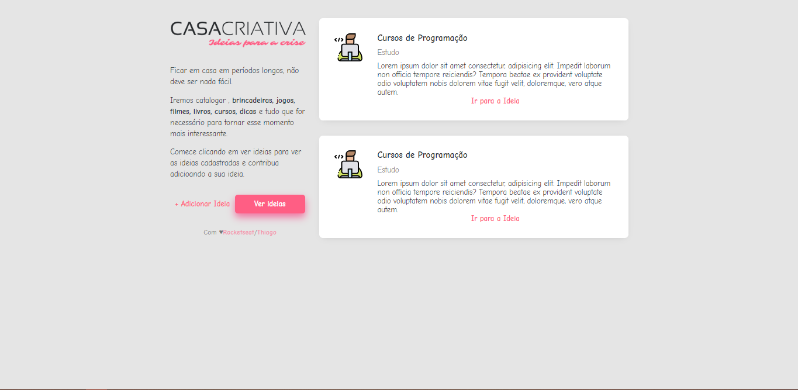
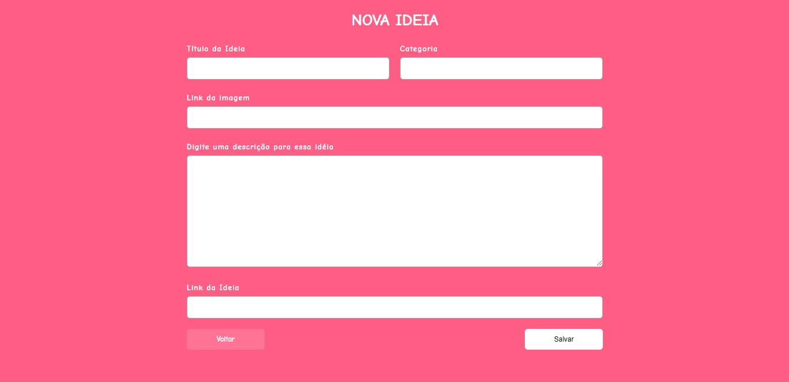
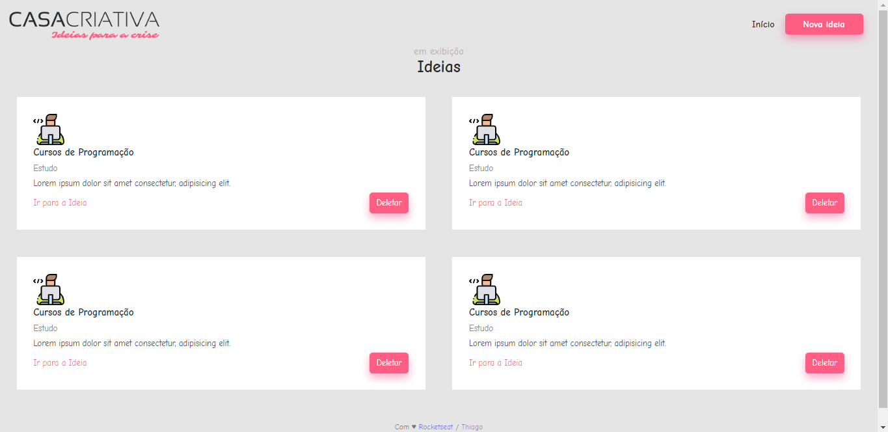

# WorkShopDev-2020

<h2>Description of the idea:</h2>

The site is called "Casa criativa", it's purpose is to list ideas to do at your free time. It was made during the difficult time of 
Corona Virus (COVID-19). 
 

--------------------------------------------------------------Code talking--------------------------------------------------------------

Code made in the WorckShopDev week on 2020.
Some of the technologies used:

<li>Node js</li>
<li>Nunjucks</li>
<li>Nodemon</li>
<li>Sqlite3</li>  
   
 
   

Now finished by the ideas made during the week, the code isn't the same as the teacher made. I did some things myself, 
an in near future I will update it to add some functionalities that couldn't be made durring the week.
What I have in mind today is: Add fucntion to delete an idea(already have the button made and the function call);
A user stucture to log in with different acconts. 

--------------------------------------------------------------Code talking--------------------------------------------------------------
<h2> This are prints from the pages of the site. In order: "Inicio" , "Nova ideia" , "Ideias". </h2>

